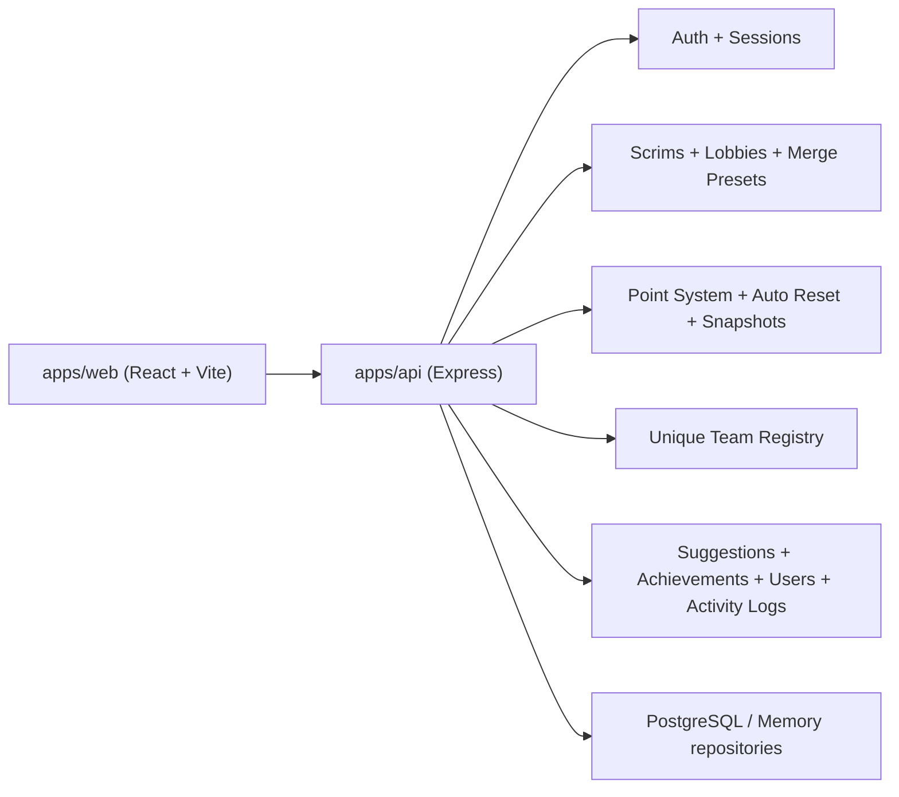

# Architecture

## High-level shape

## Frontend

- React Router with route-level RBAC
- Shared route contract imported from the backend contract directory
- Feature pages for dashboard, scrims, merges, tournaments, exports, suggestions, achievements, settings, users, and unique teams

## Backend

- Express app with module-per-domain routing
- Cookie auth middleware and request-id logging
- Repository abstraction for `memory` and `postgres` drivers
- Activity log and auth audit log separation

## Key runtime flows

### Live scrim editing

1. User opens `/scrims`
2. Frontend loads structure and active lobby entries
3. Lobby rows autosave through `PUT /api/scrims/lobbies/:id/entries`
4. Backend recalculates placement points, totals, and rank order

### Merge preview

1. User selects lobbies or a saved preset
2. Frontend requests preview or preset standings
3. Backend merges lobby standings using the shared scoring contract

### Reset execution

1. Admin runs a config from `/settings`
2. Backend resolves the favorite merge
3. Merged standings are written to `daily_snapshots`
4. Live lobby entries are cleared
5. An automation run record is stored
6. An automatic achievement entry is recorded

## Shared contracts

- `apps/api/src/contracts/app-contract.ts`
- `apps/api/src/contracts/competition-contract.ts`

These keep route authority and scoring logic synchronized across the stack.
