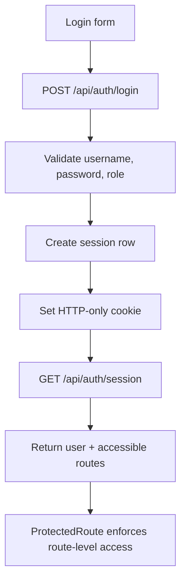

# Auth Flow

## Summary

- Login is role-aware: username, password, and selected role must all match.
- The backend issues an HTTP-only session cookie.
- Every protected request resolves the session server-side.
- Frontend route access is derived from the centralized route contract.

## Flow

## Session behavior

- Cookie name is controlled by `SESSION_COOKIE_NAME`.
- Session expiry is controlled by `SESSION_TTL_HOURS`.
- Invalid or expired sessions produce `401` and trigger frontend logout handling.

## Audit events

The auth subsystem writes immutable `audit_logs` for:

- `LOGIN`
- `LOGOUT`
- `FAILED_LOGIN`
- `ROLE_VIOLATION`
- `INVALID_ACCESS_ATTEMPT`
