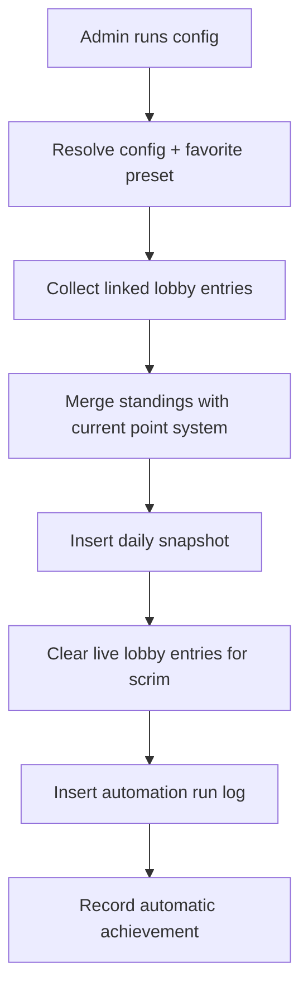

# Automation System

## Components

- point-system settings
- auto-merge configs
- execution plans
- automation run history
- immutable daily snapshots

## Reset lifecycle

## Key guarantees

- one config per scrim
- one run per config per date
- one snapshot per scrim per date
- snapshots remain immutable

## APIs

- `GET /api/auto-merge/configs`
- `POST /api/auto-merge/configs`
- `GET /api/auto-merge/configs/:id/plan`
- `POST /api/auto-merge/configs/:id/run`
- `GET /api/auto-merge/runs`
- `GET /api/auto-merge/point-system`
- `PUT /api/auto-merge/point-system`
- `GET /api/auto-merge/snapshots`
