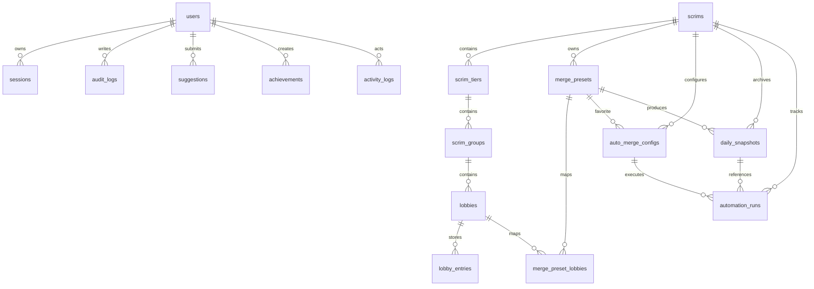

# Database Schema

## Core entities

## Important tables

- `users`, `sessions`, `audit_logs`
- `teams`
- `scrims`, `scrim_tiers`, `scrim_groups`, `lobbies`, `lobby_entries`
- `merge_presets`, `merge_preset_lobbies`
- `auto_merge_configs`, `daily_snapshots`, `automation_runs`
- `suggestions`, `achievements`, `activity_logs`
- `system_settings`

## Safety constraints

- unique usernames
- unique refresh token hashes
- unique normalized team names
- one auto-merge config per scrim
- one daily snapshot per scrim per date
- one automation run per config per date
- immutable `audit_logs`
- immutable `daily_snapshots`

## Settings storage

- `system_settings.key = 'point-system'`
- value JSON stores `killPointValue` and `positionPoints`
